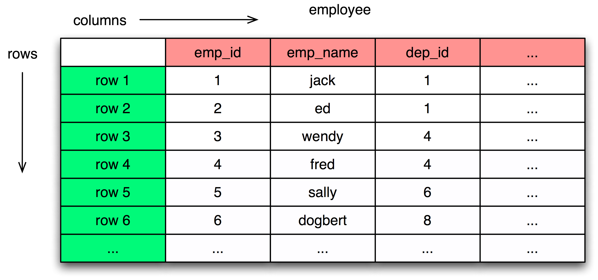

===========================
Relational Database Review
===========================

Introduction
============

This document is a brief overview of key relational database concepts, including SQL basics as well as the basics
of transactions.  SQLAlchemy is somewhat unique in that it doesn't try to hide any of these concepts
within regular use, and the developer of a SQLAlchemy-enabled application will
be dealing with concepts of SQL, concepts of transactions, and concepts of Python expressions and object
models, all at the same time.   While this may sound daunting, it is in practice actually a better way
to work, instead of relying upon a tool to hide away the existence of the relational database, and
once mastered, you'll be able to call yourself an Alchemist :).

The *Introduction to SQLAlchemy* tutorial starts off with the assumption that the student is familiar
with the concepts outlined in this document - if they're new to you, spending some time familiarizing
will be time well spent, and if they're old hat, you'll be in good shape to jump right into the
SQLAlchemy tutorial.

Key Aspects of Relational Databases
====================================

* Relational Databases, or RDBMS, are databases that draw upon the
  :term:`Relational Model`, created by :term:`Edgar Codd`.

* RDBMS organizes data into tables, rows, and columns, mimicking
  similar concepts in the relational model.

* The relational model encourages :term:`normalization`, which is a system of
  minimizing repetition and dependency between rows.

* RDBMSs use :term:`Structured Query Language` to access and manipulate rows.

* RDBMSs provide guarantees for data using the :term:`ACID` model.

Table
=====

The Table is the basic unit of storage in a relational database, representing a set of rows.

At the SQL console, we can create a new table using the CREATE TABLE
directive.  CREATE TABLE is an example of Data Definition Language, or
DDL::

	CREATE TABLE employee (
	     emp_id INTEGER,
	     emp_name VARCHAR(30),
	     dep_id INTEGER,
	     PRIMARY KEY (emp_id)
	)

